# Edge Mailer

[English](README.md) | [简体中文](README-zh_CN.md)


A mail sending request translation service built on Cloudflare Workers and [zou-yu/worker-mailer](https://github.com/zou-yu/worker-mailer/), which calls third‑party packages to send emails via the SMTP protocol.

*In plain words, it's a middleman.* 😂

---

## Quick Start

### Deployment Steps

1. Click the Fork button to fork the repository to your GitHub account.
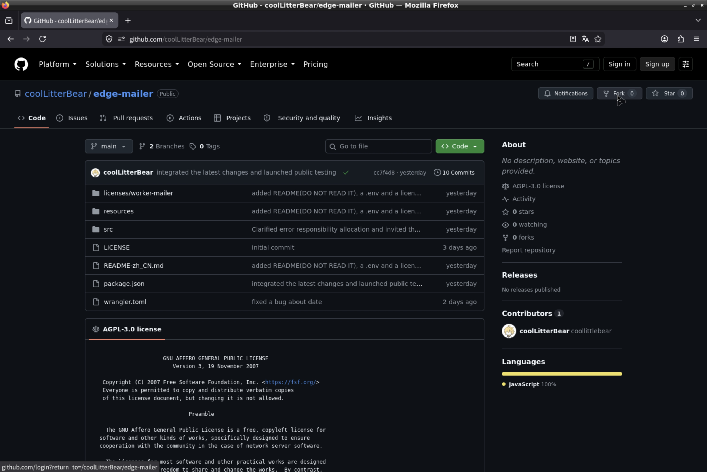

2. Open the [/resources/.env.example](./resources/.env.example) file in this repository and copy its contents for later use.
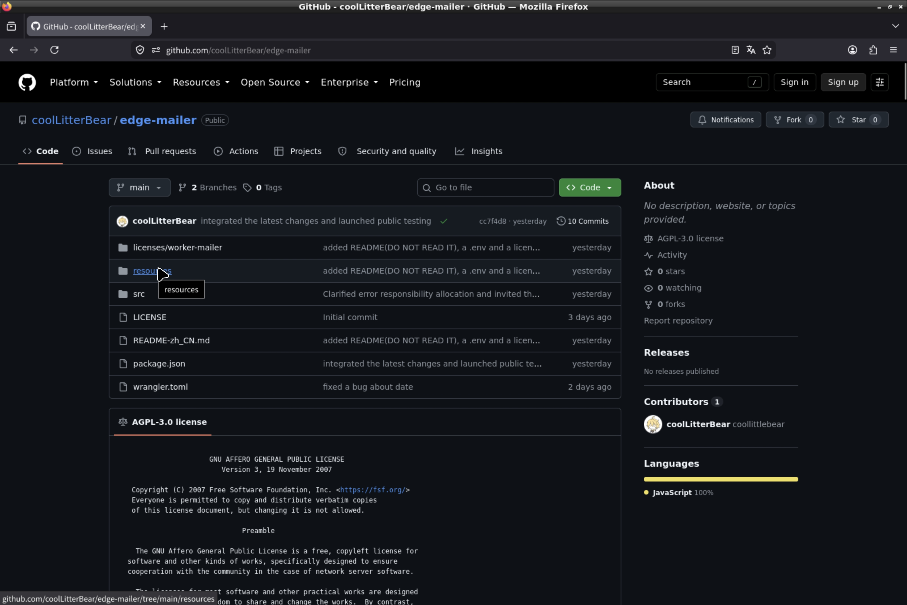
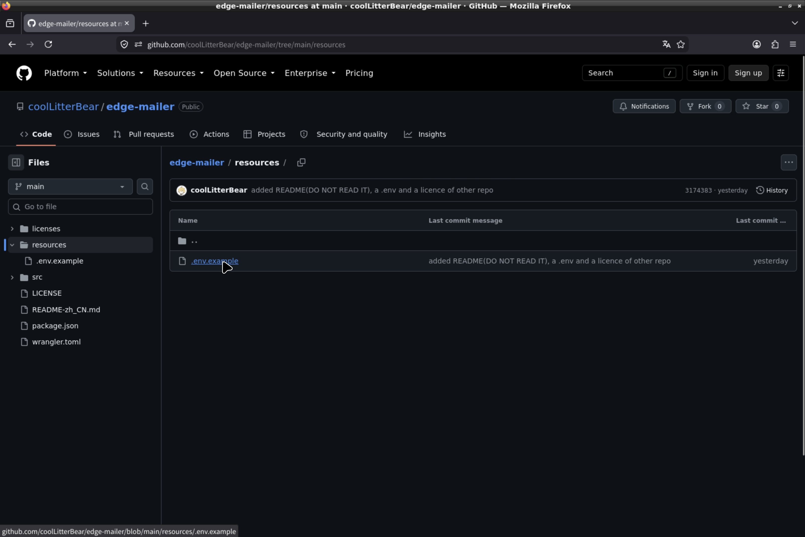
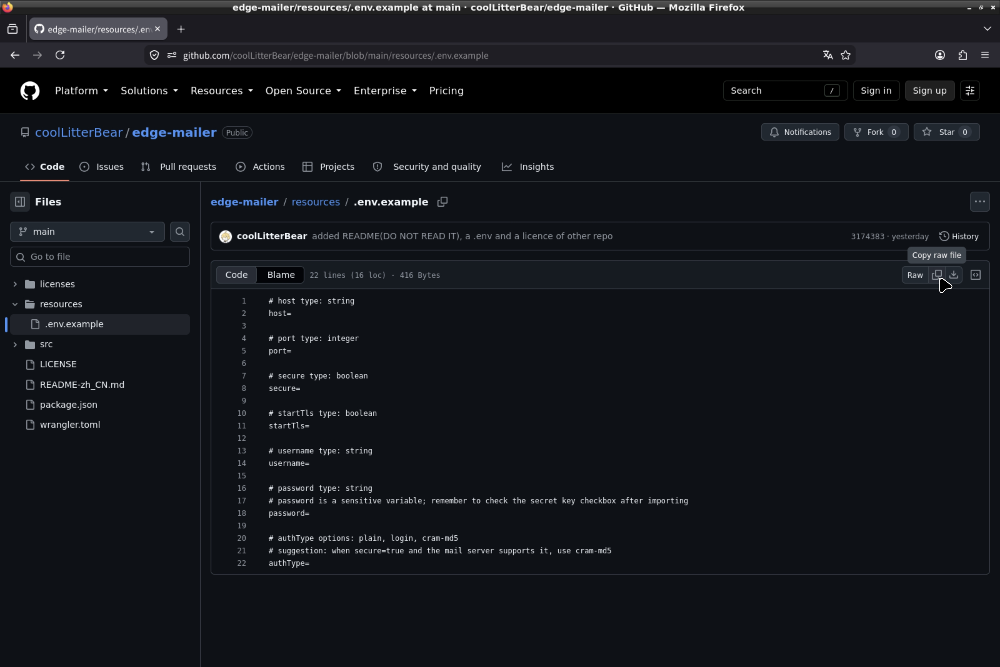

3. Go to [Cloudflare](https://dash.cloudflare.com), select **Compute** > **Workers & Pages**, and click **Create Application**.
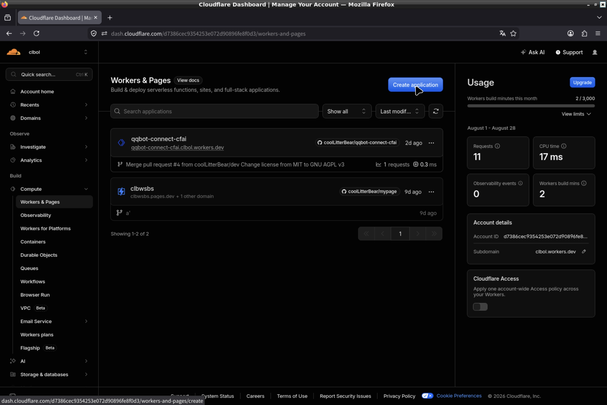

4. Choose **Continue with GitHub**.
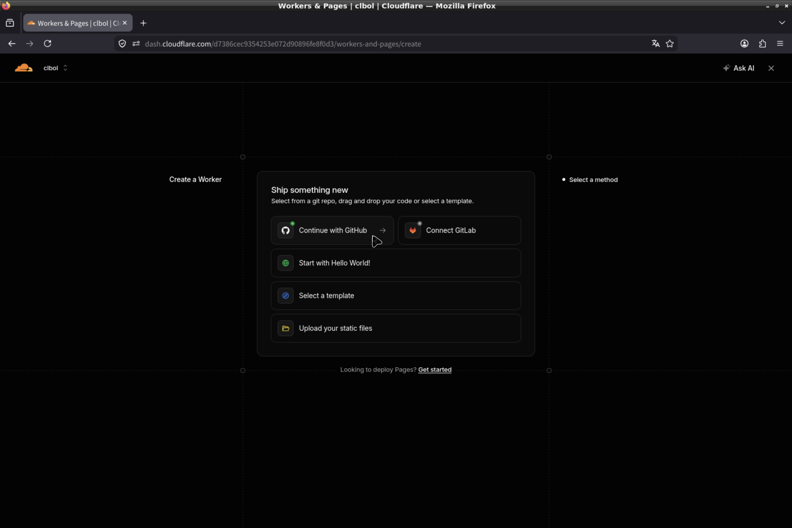

5. Connect to your GitHub account and authorize the forked repository. After returning to Cloudflare, select the just‑authorized repository and continue.
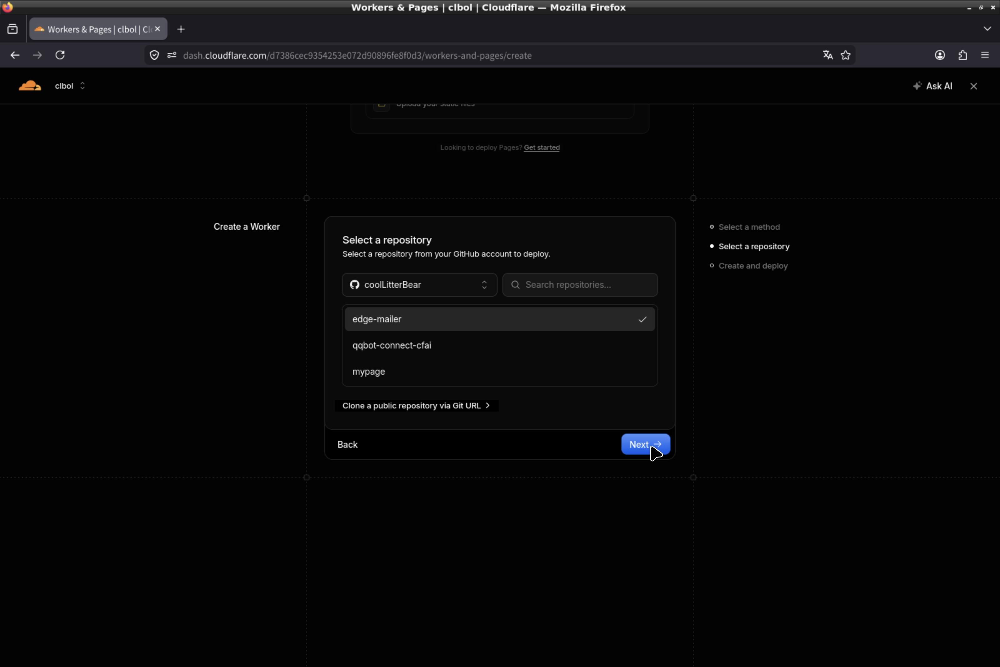

6. If you are unsure about what you are doing, do not modify anything, and click Deploy.
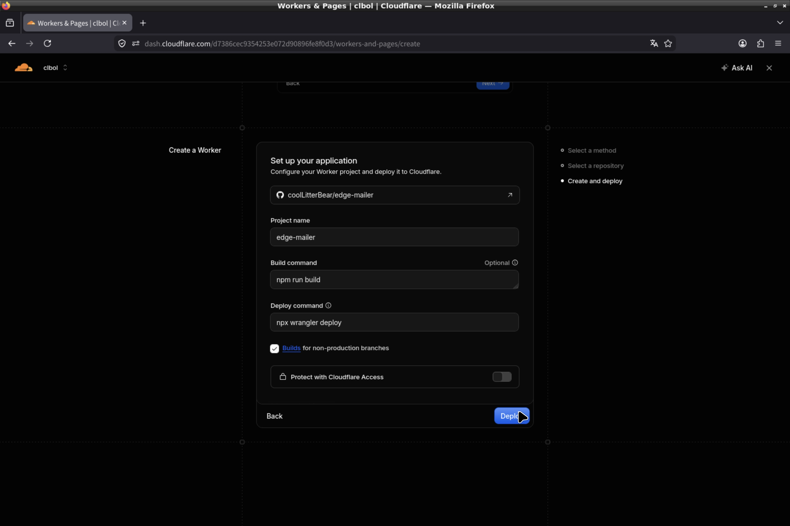

7. After deployment is complete, go to the **Settings** tab at the top. Under **Runtime Variables**, select **Import .env file**, paste and modify the content you copied earlier, then click **Import .env**. Change the **Type** of the `password` field to **Secret**.
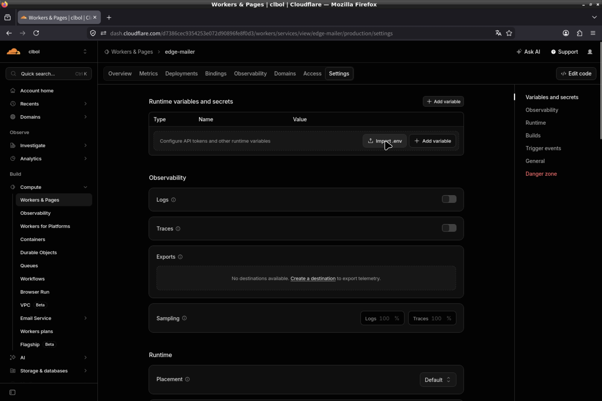
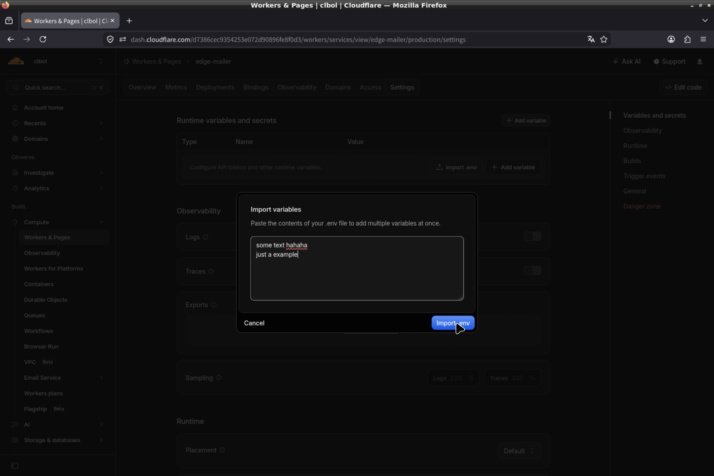
    > Each time the Worker pulls from the GitHub repository, it will delete environment variables. Remember to update them.

8. Check the **Domains** tab to see if the production domain is enabled, and copy the domain URL.
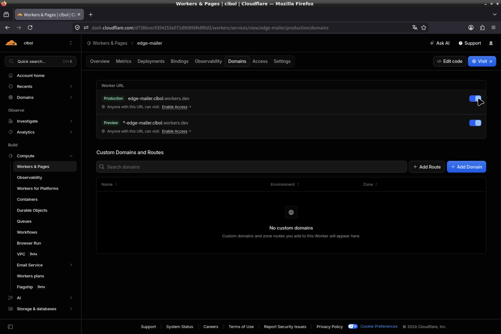

---

### Request Method

Only the `POST` method is supported.

### Request Headers

The header `Content-Type: application/json` must be included.

*Actually, we only handle this.*

### Request Body Format

A JSON object containing the following four fields:

- `from` (string; optional, needs to be configured in environment variables): Sender email address.
- `to` (array of strings): Recipient email addresses, at least one.
- `subject` (string): Subject of the email.
- `html` (string): Email body. (Due to technical reasons, HTML format is not currently supported; this will be fixed in the next patch.)

Example request body:

```json
{
  "from": "sender@example.com",
  "to": ["user1@example.com", "user2@example.com"],
  "subject": "Test Email",
  "html": "Hello, this is a test email."
}
```

### Response Description

- On success, returns HTTP 200 with JSON: `{"success":true,"message":"Email sent successfully"}`.

- On failure, returns the corresponding HTTP status code (400, 415, 500, etc.) and a JSON error message containing specific details.

---

## Environment Variable Description

```env
# host type: string
host=

# port type: integer
port=

# secure type: boolean
secure=

# startTls type: boolean
startTls=

# username type: string
username=

# password type: string
# password is a sensitive variable; remember to check the secret key checkbox after importing
password=

# authType type: string, options: plain, login, cram-md5
# suggestion: when secure=true and the mail server supports it, use cram-md5
authType=

# from type: string, optional
# from is a key variable; at least one of environment variable or request body must contain it, request body takes precedence even if it is malformed
from=
```

> Each time the Worker pulls the GitHub repository, environment variables are removed — remember to update them.


---


## Security Recommendations


- Always use TLS/SSL encrypted connections (set `secure=true` or `startTls=true`) in combination with PLAIN authentication for a balance of security and compatibility.

- Never write passwords in code or commit them to version control.

- Regularly update dependencies and the Wrangler version to promptly fix security vulnerabilities.


---


## Contributing & License


This project is licensed under [AGPL v3](./LICENSE). Issues and Pull Requests are welcome.

If you have any questions, please refer to the [Cloudflare Workers official documentation](https://developers.cloudflare.com) or [contact me](mailto:hi@clb.us.ci).